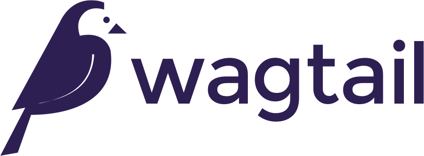
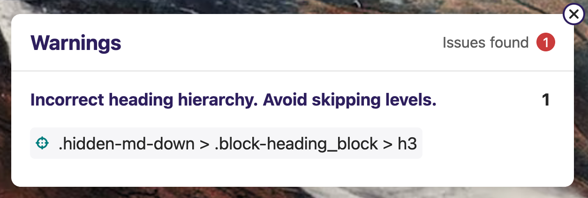

class: title wagtail

# Improving the Editor Experience<br>Through Validation
## Scott Cranfill (he/him)
## Wagtail Space US 2024

???

Hello, everyone! My name is Scott Cranfill, my pronouns are he/him, and I'm here to talk to you about how custom validation can improve the Wagtail experience for your editors, and therefore your users.


---

# Who am I?

.left-column[

- Full Stack Web Developer at NASA's Jet Propulsion Laboratory
- Resident of Rochester, New York
- Member of the Wagtail Core Team and Accessibility Team

]
.right-column[




]

.footnotes[

<span style="font-size: 14pt;">BLM ROC logo credit: [www.dunwoode.design](https://www.dunwoode.design/)</span>

]

???

To introduce myself briefly, I work as a full-stack web developer at NASA's Jet Propulsion Laboratory, but I'm speaking here in my personal capacity, not for my employer.

JPL is located in Pasadena, California, but I work from my home in Rochester, New York.

And, aside from just using Wagtail at JPL, I'm a member of the Wagtail Core Team, and its Accessibility Team, too.


---

class: title reverse

# What is validation?

???

Let's start with a brief introduction to the concept of validation in Django.


---

# Validation in Django

The process of checking that something is acceptable before saving it to the database.

- Can apply to form fields, model fields, and model instances
- As simple as required fields
- As complex as the relationship between multiple fields on a model instance
- Happens automatically when attempting to save a model instance

???

As we like to say, "Wagtail is just Django", so the foundation of Wagtail's validation features comes straight from Django. In the Django world, the term "validation" refers to the process of checking that something is acceptable before saving it to the database. (That's my personal, vague definition.)

This broad concept applies in three main areas in Django: form fields, model fields, and model instances. Forms are weird, and handled transparently by the Wagtail admin, so we're going to focus on models here.

Validation can be as simple as checking that a required field has been given a value, and it can be as complex as looking at the relationship between multiple fields, or taking into account external factors like the current date, or the API response from some service, and more.

Wagtail relies on the standard Django behavior of validating a model instance when trying to add it to the database (or update its existing record).


---

# A simple example

```python
from django.core import validators
from django.db import models

class Card(models.Model):
    title = models.CharField(null=False, blank=False)
    desc = models.TextField(null=False, blank=False)
    link_text = models.CharField(null=True, blank=True)
    link_url = models.CharField(
        null=True,
        blank=True,
        validators=[validators.URLValidator]
    )
```

???

Here is a simple Django model for the kind of card you might see on many websites. It has title and description fields that are required (note the null and blank values that are `False`) and two fields that support an optional link to be displayed below the description.

When you attempt to save a new instance of this `Card` model, Django will go through four validation steps:


---

# Django's four-step validation

1. Validate the model fields - `Model.clean_fields()`
2. Validate the model as a whole - `Model.clean()`
3. Validate the field uniqueness - `Model.validate_unique()`
4. Validate the constraints - `Model.validate_constraints()`

.footnotes[
  
https://docs.djangoproject.com/en/4.2/ref/models/instances/#validating-objects

]

---

# 1. Validate the model fields

```python
from django.core import validators
from django.db import models

class Card(models.Model):
    title = models.CharField(null=False, blank=False)
    desc = models.TextField(null=False, blank=False)
    link_text = models.CharField(null=True, blank=True)
    link_url = models.CharField(
        null=True,
        blank=True,
        validators=[validators.URLValidator]
    )
```

???

Looking back at our example, step one covers the items we see written into the field definitions:
- Are the required title and description fields populated?
- If there is a value in the link URL field, does it look like an actual URL?


---

# Custom field validation functions

```python
class ConferencePhoneValidator(validators.RegexValidator):
  """
  Only allow valid characters for conference phone numbers.
  - Only numeric, "+", ",", and "#" characters are allowed.
  """
  regex = r'^[0-9+,#]+$'
  message = "Enter a valid conference phone number. The three groups of numbers in this  example are a Zoom phone number, meeting code, and password: +19294362866,,2151234215#,,#,,12341234#"
  flags = 0
```

???

You can also write your own validation functions, either from scratch, or extending Django built-ins, like our friend Tim did here to validate Zoom conference phone numbers, subclassing `RegexValidator` to specify the regular expression to match and a custom error message if it fails.

So, that's step 1, validating individual fields. Simple enough, but what about the rest?


---

# 2. Validate the model as a whole

```python
class Model(AltersData, metaclass=ModelBase):
    # ...
    
    def clean(self):
        """
        Hook for doing any extra model-wide validation
        after clean() has been called on every field
        by self.clean_fields. ...
        """
        pass
```

.footnotes[

https://github.com/django/django/blob/main/django/db/models/base.py#L1338-L1345

]


???

Step 2 is to validate the model as a whole. This is done by invoking the `clean()` method on your model class. "What is the `clean()` method?" Well, it's a special method provided by Django's base `Model` class, which does nothing by default, but serves as a hook for you to add your own validation based on your specific model's needs, which will be run when saving your model. What I'm showing here is the Django `Model.clean()` source code, which amounts to just a method declaration with a comment basically saying what I just told you.


---

# Wagtail's `Page.clean()`

```python
class Page(AbstractPage, ...):
  # ...

  def clean(self):
    super().clean()
    parent = self.get_parent()

    if not Page._slug_is_available(self.slug, parent, self):
      raise ValidationError({
        "slug": "Slug is already in use within parent."
      })
```

.footnotes[

https://github.com/wagtail/wagtail/blob/main/wagtail/models/__init__.py#L1455-L1466

]

???

Let's look at how Wagtail's core `Page` model uses the `clean()` hook. This is slightly condensed to fit it on the slide. It's still a bit tough to follow, but the idea is that when saving any Wagtail page it checks to make sure that the desired slug is available for use – that is, it's a unique slug under its parent. If the desired slug is not available, it raises a `ValidationError`, which the Wagtail UI presents to the editor.

This gets run not only on initial page publish, but every time it's updated (in case the slug field was changed), and also in situations like when a page is moved under a new parent.


---

class: title reverse

# The secret sauce:

<div class="title-code">`super().clean()`</div>

???

The most important line on the previous slide is this one. The Wagtail `Page` model's `clean()` method starts by calling `super().clean()`. The `super()` function is a special function for subclasses that, when used in the a method, returns a temporary object of its superclass. This then allows you to call that superclass's methods. So when Wagtail's `Page.clean()` calls `super().clean()`, it's invoking the `clean()` method of its parent class. In this way, it ensures that we're not missing out on any validation done by that parent class when we override the `clean()` method for `Page`.


---

# Validating your own page models

```python
from django.core.exceptions import ValidationError
from django.db import models
from wagtail.models import Page

class EventPage(Page):
  start_date = models.DateTimeField()
  end_date = models.DateTimeField()
  
  def clean(self):
    super().clean()
    if self.end_date < self.start_date
      raise ValidationError({
        "end_date": "End date can't be before start."
      })
```

???

And you can continue the `clean()` chain on your own models that inherit from Wagtail's `Page` model! Here's a simple example for an event page, where we want to validate that the end date is always after the start date. We define a `clean()` method on our `EventPage` class, call `super().clean()` to do the slug validation we just saw on the Wagtail `Page` class (along with any `clean()` methods further up the model inheritance chain), and then check our dates, and if end date is "less than" start date (meaning, earlier than), then we raise a `ValidationError`, which prevents the page from saving and displays the error message in the UI.

Now, I'm going to skip over parts 3 and 4 of Django's validation process. They're important, but overriding the `clean()` method is the biggest opportunity for improving your editor experience, so that's where the rest of the talk will be focused.

What else might we want to validate on a page model?


---

# Enforcing specific slugs

```python
class AuthorBioPage(Page):
    text = models.RichTextField()
    
    # Can only be created under AuthorPages
    parent_page_types = ["AuthorPage"]
    # Only 1 may exist under a given parent
    max_count_per_parent = 1
    
    content_panels = Page.content_panels + [
        FieldPanel("text"),
    ]
```

???

Let's say you've got a page type that you only want one of under any given parent and you want each one of those to have the same slug. For example, an author page may have a child page that's a full biography, and you always want those pages to have a slug of `bio`.

First, we make them only creatable under author pages and use the `max_count_per_parent` property to only allow one bio page under a given parent. This will prevent any duplicate slug issues.


---

# Enforcing specific slugs

```python
    def clean(self):
        super().clean()
        self.slug = "bio"
```

???

Now we can write our `clean()` method, which in this case doesn't need to validate a user-entered slug – it can just set them itself! After the `super()` call, we just set the slug to `bio`, which again will always be unique under a given parent.

To be fair, overriding whatever the user might have put in the slug field like this could be a little confusing for users, so another thing that you could do is redefine the stock `Page.promote_panels` to remove the slug field, so users can't even try to set or change the slug.


---

class: title

# Related fields

???

A classic scenario in any CMS is to have a field that is somehow dependent on the value of another field. Wagtail doesn't have a built-in way to dynamically reveal or modify form fields when another field is updated, so displaying both fields and validating them together on save is a good approach to take.


---

# Related fields

```python
class Mission(Page)
    launch_date_status = models.CharField(
        choices=LaunchDateStatus.choices,
        default=LaunchDateStatus.NONE,
        max_length=25
    )
    launch_date = models.DateField(
        null=True,
        blank=True,
        help_text="This can be left blank for TBD or unknown launch dates"
    )
```

???

Here's a snippet of a Mission page model that has a couple related launch date fields. The first, `launch_date_status`, has several different choices that determine how the date is formatted on the front end.

---

# Related fields

```python
from django.db.models import TextChoices

class LaunchDateStatus(TextChoices):
    KNOWN = "known", "Known launch date (display full launch date)"
    TBD = "tbd", "TBD launch date (display TBD text)"
    TBD_YEAR_ONLY = "tbd_year_only", "TBD launch date (display year only)"
    TBD_MONTH_AND_YEAR_ONLY = "tbd_month_and_year_only", "TBD launch date (display year and month only)"
    NONE = "none", "No launch date (nothing will display for launch date)"
```

???

Here's a quick look at what those choices are. The exact date can be known, or it can be three different kinds of uncertain, or we may not want to show anything at all.


---

# Related fields

```python
class Mission(Page)
    launch_date_status = models.CharField(
        choices=LaunchDateStatus.choices,
        default=LaunchDateStatus.NONE,
        max_length=25
    )
    launch_date = models.DateField(
        null=True,
        blank=True,
        help_text="This can be left blank for TBD or unknown launch dates"
    )
```

???

Then there is the `DateField` for actually choosing a launch date. Depending on what is selected for `launch_date_status`, we may want to require an actual `launch_date` to be entered.


---

# Related fields

```python
def clean(self):
    super().clean()
    launch_date_required = self.launch_date_status in [
        LaunchDateStatus.KNOWN,
        LaunchDateStatus.TBD_YEAR_ONLY,
        LaunchDateStatus.TBD_MONTH_AND_YEAR_ONLY,
    ]

    if launch_date_required and not self.launch_date:
        raise ValidationError({
            "launch_date": "Launch date is required for the launch date status selected."
        })
```

???

So here's the `clean()` method that lets us do that. If the `launch_date_status` is exactly known, or even if we only know the year or month and year, then the launch date field is required, so if it's not set, then we raise the `ValidationError`.


---

class: title

# Raising multiple validation errors

???

In the real code I'm excerpting this from, there are actually _multiple_ things that get checked in our `clean()` method. To raise multiple validation errors at once, you have to collect them in a dictionary and then raise them all at once.


---

# Raising multiple validation errors

```python
def clean(self):
    super().clean()
    errors = defaultdict(list)

    if self.show_clock and not self.start_date_time:
        errors["show_clock"].append('Add a start date/time or untick "Show clock".')
    if launch_date_required and not self.launch_date:
        errors["launch_date"].append("Launch date is required for the launch date status selected.")

    if any(errors.values()):
        raise ValidationError(errors)
```


???

Here's a condensed view of how that looks. We start with a fresh errors dictionary, and then we append to that if needed as we go through each different individual validation scenario. Then if there is anything in the errors dict at the end, we raise a `ValidationError`, passing in the dict, and it will highlight each item in it.


---

class: title reverse

# StreamField Blocks

???

Validating standard Django model fields is great and all, but as many of you know, much of Wagtail's magic comes from its StreamField editing interface, and the blocks that editors can add within that. Thanks to a great contribution by Matt Westcott in Wagtail 5.0, this same basic `clean()` pattern can be applied to your custom StreamField blocks!

Let's look at a few common custom blocks and how we might want to validate them.


---

# Link blocks

```python
class LinkBlock(StructBlock):
    page = PageChooserBlock(required=False)
    document = DocumentChooserBlock(required=False)
    url = URLBlock(required=False)
    text = CharBlock(required=False, help_text="Required for URLs. If not entered for a page or document link, the text will default to their title.")
```

.footnotes[

https://docs.wagtail.org/en/stable/advanced_topics/customisation/streamfield_blocks.html

]

???

Creating a LinkBlock is a rite of passage for Wagtail developers. Everyone eventually wants this sort of block, where you can choose one of several kinds of link destinations, enter your link text, and output the resulting link markup. I borrowed this example from the Wagtail docs page listed below and modified it slightly.

We're defining a new subclass of StructBlock, and it's got three child blocks to determine what kind of link you want to create – an internal page link, a link to a document in your document library, or an external URL – and then a block for specifying the text of the link. As the help text for the link text block notes, we want to require it for external links, but if we are using a page or document link, it can be optional, and the link text would be set to the title of the page or document. Everything needs to be set to **not** be required due to the different combinations we want to allow.

Now we want to validate that exactly one of the link type blocks has been populated, and that the text has been added if it's an external link.


---

# Basics of block validation

```python
def clean(self, value):
    result = super().clean(value)
    
    # do your validation by inspecting the result dict
    
    return result
```

.footnotes[

https://docs.wagtail.org/en/stable/advanced_topics/streamfield_validation.html

]

???

When overriding the `clean()` method on a StreamField block, we have to do a couple things a little differently than we did with our page model. The first thing to note is that the function signature is different; you must pass in the `value` of the block. You also must return the cleaned value at the conclusion of the function, if no validation error was raised.

Like before, you use a `super()` method to call the parent class's `clean()` method, but this time we pass the `value` through, and store the resulting dictionary in a new variable so that we can use it to perform the validation we want.


---

# Validating our `LinkBlock`

```python
def clean(self, value):
    result = super().clean(value)
    
    if not (
        result["page"]
        or result["document"]
        or result["url"]
    ):
        raise ValidationError("Page, document, or URL must be set to determine link destination.")

    # to be continued
```

???

Let's take a look at what this looks like for the `LinkBlock` we defined earlier.

After setting the initial `result` with our `super().clean()` call (passing in the value, as noted before), we do our first check: making sure that at least one of our link types has been set. If not, alert the user.

If that passes, …

---

# Validating our `LinkBlock`


```python
def clean(self, value):
    # continued from previous slide
    
    if (
        (result["page"] and result["document"])
        or (result["page"] and result["url"])
        or (result["document"] and result["url"])
    ):
        raise ValidationError("Please set only one type of link (page, document, or URL).")
    
    # to be continued
```

???

… then we'll make sure that _only_ one of them is set. If any pair of them are both set, we alert the user that only one may be set.

If we make it past that …


---

# Validating our `LinkBlock`


```python
def clean(self, value):
    # continued from previous slides
    
    if result["url"] and not result["text"]:
        raise ValidationError("Text required for URL links.")

    return result
```

???

… then we do our final check: if the raw URL child block has been used but no link text has been entered, alert the user that text is required in that instance.

If we get past all of those checks without raising an error, then we return the valid `result`.

As these validation errors are all mutually exclusive, we don't need to worry about collecting multiple errors and raising them together.

---

# Image blocks

```python
class ImageBlock(StructBlock):
    image = ImageChooserBlock()
    alt_text = CharBlock(required=False)
    decorative = BooleanBlock(required=False)
```

???

Now let's take a look at another very common block for Wagtail developers to implement: an image block. Here's an example of a simple `ImageBlock` that bundles a basic `ImageChooserBlock` with  a couple of accessibility-related blocks. The alt text child block accepts some text to be output in the `img` element's `alt` attribute, while the `decorative` `BooleanBlock` creates a checkbox to indicate that no alt text is needed for this image in this context.

Not shown here but something to be aware of behind the scenes is that we have added a required default alt text field to our custom image model, which will be output if no alt text entered in this block _and_ the decorative checkbox is not checked. This is a useful fallback, but it is important to encourage editors to enter alt text (or determine none is needed) for each image in the context where it is used, so that's what this image block provides.


---

# Validating our `ImageBlock`

```python
def clean(self, value):
    result = super().clean(value)

    if result["alt_text"] and result["decorative"]:
        raise StructBlockValidationError(
            block_errors={
                "alt_text": ValidationError("Marking an image as decorative will override alt text entered here. Empty this field or uncheck the decorative box.")
            }
        )

    return result
```

???

Let's look at how we want to validate this block. The main thing we want to do is prevent folks from both entering alt text _and_ checking the decorative flag. This is pretty simple to do, following a similar pattern to what we used earlier for related fields on a page model.

The one additional thing that this example demonstrates is the use of the special `StructBlockValidationError`. If you just raise a simple Django `ValidationError` on a StructBlock, like we did on the previous `LinkBlock` example, then the error message will be presented on the block as a whole. By instead utilizing the `StructBlockValidationError`, we can present the error message next to a specific child block within the `StructBlock`. When raising `StructBlockValidationError`, we pass a dictionary to the `block_errors` argument, where the keys correspond to the name of one of your child blocks, and the values are a `ValidationError` instance with the message you want to go with that child block.

(You can also pass `ValidationError`s to the `non_block_errors` argument of `StructBlockValidationError` to be applied to the StructBlock as a whole.)

If no errors were raised, then everything is happy and we can return the valid `result`!


---

# Heading hierarchy 



???

Now let's discuss another accessibility-related validation we can handle with the help of those improvements from Wagtail 5, **incorrect heading hierarchy**.

This is a screenshot of Wagtail's accessibility checker reporting that a heading level has been skipped. What does that mean, exactly? It means on this page there was an H1 at the top, and the error is pointing to an H3, with no H2 in between.

Why is this a problem? Well, screen readers and site crawlers rely on having a logical document structure to understand the content of your page, and headings are the primary way in which they interpret that structure. One way to think about this is like a big, multi-level, numbered outline in a Word document. If you indented two levels at once, that would look pretty strange and potentially confuse readers, wouldn't it? Similarly, webpage headings should avoid skipping levels, as they create the outline of the page.

The accessibility checker is great for helping editors identify when a mistake has been made, but what if we could prevent them from being made in the first place?


---

# A simple heading block

```python
class HeadingBlock(StructBlock):
    heading_text = CharBlock(required=True)
    size = ChoiceBlock(
        choices=[
            ("", "Select a header size"),
            ("h2", "H2"),
            ("h3", "H3"),
            ("h4", "H4"),
        ],
        blank=True,
        required=False,
    )
```

???

Here's an example (more-or-less) direct from the Bakery Demo of a heading block, which is a common block that is often one of the first to be set up in a StreamField. It has two child blocks, one for the text of the heading and one to set the size (or level) of the heading.

This is an essential tool for editors, but if they aren't aware of the requirement to avoid skipping levels, there's nothing to stop them from doing so. Again, the accessibility checker can catch it after the fact, but let's use another custom `clean()` method to prevent it.


---

# Setting up a `StreamBlock`

```python
class BaseStreamBlock(StreamBlock):
    heading_block = HeadingBlock()
    rich_text_block = RichTextBlock(
        features=["bold", "italic", "link", "ul", "ol"]
    )
    image_block = ImageBlock()


class NewsPage(Page):
    body = StreamField(BaseStreamBlock())
```

???

In this case, we want to validate across _multiple_ instances of our `HeadingBlock`, so we can't place our custom `clean()` on the `HeadingBlock` class itself. Instead, we want to apply to a subclass of `StreamBlock`, which is a data structure that can be used to provide a common set of block options to any StreamField in your project.

In this example, this `BaseStreamBlock` offers three different block choices – headings, rich text, and images – and then we pass that to the body in this example `NewsPage`, which makes those three blocks available in that StreamField.


---

# Validating our `BaseStreamBlock`

```python
class BaseStreamBlock(StreamBlock):
    # ...
    
    def clean(value):
        result = super().clean(value)

        headings = [
            # tuples of block index and heading level
            (0, 1)  # mock H1 block at index 0
        ]
        errors = {}

        # to be continued
```

???

The general idea for this `clean()` method is to look at each heading block in the StreamField and raise an error if it has skipped a level since the previous heading on the page. After the initial `super()` call, we will start by creating a list for tracking all of the headings we encounter. Each item in the list will be a tuple of the block's index within the StreamField and the heading's level. It's preloaded with a placeholder for the page's H1 – which we know will exist on the rendered page, but is not actually a block in the StreamField. And we also initialize our errors dict, in case we need it.


---

# Validating our `BaseStreamBlock`

```python
def clean(value):
    # continued from previous slide

    # first iterate through all blocks in the StreamBlock
    for i in range(0, len(result)):
        # if a block is of type "heading?
        if result[i].block_type == "heading":
            # convert size string to integer
            level = int(result[i].value.get("size")[-1:])
            # append tuple of block index and heading level to list
            headings.append((i, level))

    # to be continued
```

???

The next step is looping through all of the child blocks in the StreamBlock we're validating, and if a block is a heading block, we store its index and level in the headings list.

At the end of this loop, we have our complete list of headings in the stream.


---

# Validating our `BaseStreamBlock`

```python
def clean(value):
  # continued from previous slides

  # now iterate through list of headings, starting with
  # second heading to skip over the mock H1 heading block
  for i in range(1, len(headings)):
    # compare its level to the previous heading's level
    if int(headings[i][1]) - int(headings[i-1][1]) > 1:
      # if the difference is more than 1, add an error
      # to the errors dict with its original index
      errors[headings[i][0]] = ValidationError("Incorrect heading hierarchy. Avoid skipping levels.")

    # to be continued
```

???

Next, we do another loop, this time through that list of headings. We start at the second heading in the list, and compare each one to the previous one. If the difference between the heading being checked and the previous heading is greater than 1, then we have incorrectly skipped a heading level, so we add a `ValidationError` to the errors dictionary, using its original index as the key so that the error message will appear in the right place.


---

# Validating our `BaseStreamBlock`

```python
def clean(value):
    # continued from previous slides

    if errors:
        raise StreamBlockValidationError(block_errors=errors)

    return result
```

???

With that loop complete, we check to see if the `errors` dictionary has anything in it, and if it does, we raise a `StreamBlockValidationError`, passing the `errors` dict into the `block_errors` param. If there were no errors, we're all good, so we return the valid `result`.

In the interest of time, I won't go through the code for it, but the principles we've discussed throughout this presentation can be combined and applied to examining all headings on a page, whether they come from a `HeadingBlock` or are included in a `RichTextBlock` or `RichTextField`.


---

# It works in site settings, too!

```python
@register_setting
class SiteWideAlertSettings(BaseSiteSetting):
    enable_sitewide_alert = models.BooleanField(
        default=False
    )
    alert_text = RichTextField(
        blank=True,
        features=["h2", "h3", "bold", "italic", "link"],
    )
```

.footnotes[
    https://github.com/wagtail/wagtail.org/blob/main/wagtailio/sitewide_alert/models.py#L15-L27
]

???

Fun fact: You can even apply the `clean()` override method to site settings, which are ultimately also just Django models.

This example from wagtail.org sets up a banner that runs across the top on every page of the site when it's configured. There are a couple fields not shown, but these are the important ones in terms of what gets validated.


---

# It works in site settings, too!

```python
def clean(self):
    if self.enable_sitewide_alert and not self.alert_text:
        raise ValidationError(
            {
                "alert_text": ValidationError(
                    "To enable the sitewide alert, please specify the alert text."
                ),
            }
        )
```

???

The validation logic here is nothing earth-shattering, just ensuring that if you've checked the box to enable the alert that you have also provided some text for it. I mainly wanted to make the point that in addition to page fields and StreamField blocks, you can also use it for site settings.

---

# Some other things I've seen

???

I wanted to mention a few other more ideas I've seen in the wild that might be of interest, without going into detail.

1. You might want to enforce a certain sort order when editors are putting items into a list. For example, we have a timeline page, so we want the items on that to be sorted chronologically. You can always do this in the layer between the editor and the front end, but it can be nice to ensure that what editors see in the Wagtail admin accurately reflects how it will come out on the front end.

2. Sometimes you might not want the title to be arbitrary text entered by a user, but instead have it be set dynamically based on certain inputs. In our Wagtail-powered intranet at work, we have author detail pages for folks who have written articles. It's integrated with our LDAP directory, so instead of a regular page title field, there is a chooser for selecting a user, and then the page title is set on `clean()` by fetching the person's display name from the directory. If they don't have a display name set, it uses a combination of their first and last name.

3. Finally, if you are not particularly concerned about users potentially being surprised by this, another example from our intranet is that we automatically update the slug of a page if the title changes. (Normally Wagtail would just leave the original slug in place forever.) Wagtail automatically creates redirects for slug changes by default, though, so the potential user confusion should be minimal.
--

- Ensuring items entered into a list are sorted in the correct order
--

- Dynamically setting the title field based on other data
--

- Automatically updating the slug if the title changes


---

class: title wagtail

# Further reading

<p style="text-align: center;">
[docs.djangoproject.com/en/4.2/ref<br>/models/instances/#validating-objects](https://docs.djangoproject.com/en/4.2/ref/models/instances/#validating-objects)
</p>
<p style="text-align: center;">
[docs.wagtail.org/en/stable/advanced_topics/streamfield_validation.html](https://docs.wagtail.org/en/stable/advanced_topics/streamfield_validation.html)
</p>

???

To learn more about validation, allow me to highlight these documentation pages cited earlier, Django's validation docs and Wagtail's docs on StreamField validation. Both are great resources to help you learn more about this topic.


---

class: title

# Thank you!

<p style="text-align: center;">
https://github.com/Scotchester/wsus-validation
</p>

???

Thank you very much for your time! I've published these slides in this repository, and I hope you're inspired to go forth and improve your editor experience with custom validation.
